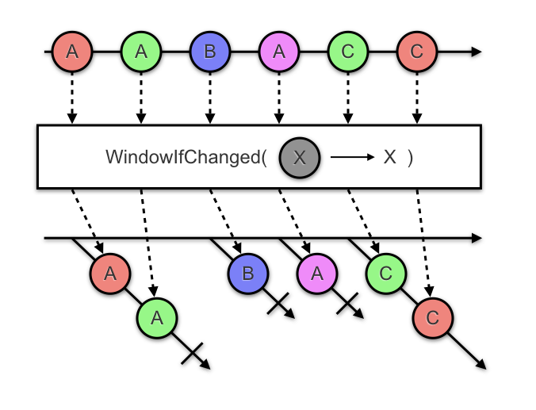

# RxJava Window If Changed

The `WindowIfChanged` operator for RxJava 2 divides an `Observable` that emits items into an
`Observable` that emits `Observables`, each one of which emits some subset of the items from the
original source. The items in each inner `Observable` all have a common "key" based on a key
selector function. A new inner `Observable` is emitted and the previous inner `Observable`
completes each time the key changes from the previous item.



```java
Observable<Actions> actions = //...

Observable<GroupedObservable<String, Action>> targetedActions =
    WindowIfChanged.create(actions, action -> action.target);
```


## Download

Gradle:
```kotlin
implementation("com.jakewharton.rx:window-if-changed:1.0.0")
```
Maven:
```xml
<dependency>
  <groupId>com.jakewharton.rx</groupId>
  <artifactId>window-if-changed</artifactId>
  <version>1.0.0</version>
</dependency>
```

If you use Kotlin, a package with an extension method for `Observable` is provided. Replace the
`window-if-changed` artifact ID above with `window-if-changed-kotlin`.

Snapshots of the development version are available in [Sonatype's `snapshots` repository][snap].


## License

    Copyright 2016 Jake Wharton

    Licensed under the Apache License, Version 2.0 (the "License");
    you may not use this file except in compliance with the License.
    You may obtain a copy of the License at

       http://www.apache.org/licenses/LICENSE-2.0

    Unless required by applicable law or agreed to in writing, software
    distributed under the License is distributed on an "AS IS" BASIS,
    WITHOUT WARRANTIES OR CONDITIONS OF ANY KIND, either express or implied.
    See the License for the specific language governing permissions and
    limitations under the License.


 [snap]: https://oss.sonatype.org/content/repositories/snapshots/
